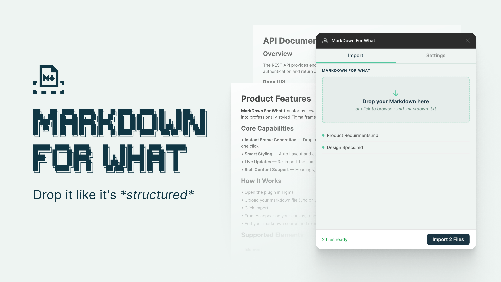

# MarkDown For What 🎵

```
███╗   ███╗ █████╗ ██████╗ ██╗  ██╗██████╗  ██████╗ ██╗    ██╗███╗   ██╗
████╗ ████║██╔══██╗██╔══██╗██║ ██╔╝██╔══██╗██╔═══██╗██║    ██║████╗  ██║
██╔████╔██║███████║██████╔╝█████╔╝ ██║  ██║██║   ██║██║ █╗ ██║██╔██╗ ██║
██║╚██╔╝██║██╔══██║██╔══██╗██╔═██╗ ██║  ██║██║   ██║██║███╗██║██║╚██╗██║
██║ ╚═╝ ██║██║  ██║██║  ██║██║  ██╗██████╔╝╚██████╔╝╚███╔███╔╝██║ ╚████║
╚═╝     ╚═╝╚═╝  ╚═╝╚═╝  ╚═╝╚═╝  ╚═╝╚═════╝  ╚═════╝  ╚══╝╚══╝ ╚═╝  ╚═══╝

███████╗ ██████╗ ██████╗     ██╗    ██╗██╗  ██╗ █████╗ ████████╗
██╔════╝██╔═══██╗██╔══██╗    ██║    ██║██║  ██║██╔══██╗╚══██╔══╝
█████╗  ██║   ██║██████╔╝    ██║ █╗ ██║███████║███████║   ██║
██╔══╝  ██║   ██║██╔══██╗    ██║███╗██║██╔══██║██╔══██║   ██║
██║     ╚██████╔╝██║  ██║    ╚███╔███╔╝██║  ██║██║  ██║   ██║
╚═╝      ╚═════╝ ╚═╝  ╚═╝     ╚══╝╚══╝ ╚═╝  ╚═╝╚═╝  ╚═╝   ╚═╝
```

**MarkDown For What** turns your Markdown files into structured design frames — automatically. Drop in a file (or a dozen), and it builds headings, body text, code blocks, tables, and images as properly styled, Auto Layout-ready frames. Update the source later? Drop it again — it finds the frame and replaces it in place.

No copy-paste. No style hunting. No duplicates.

Currently available as a **Figma plugin**.



## Features

### Content Types

- **Headings** (H1, H2, H3) with auto-generated text styles
- **Paragraphs** with full inline formatting
- **Bullet Lists** with nested sub-bullets (up to 4 depth levels with distinct bullet styles)
- **Ordered Lists** with automatic numbering and nesting support
- **Task Lists / Checklists** — `- [ ]` and `- [x]` render as styled checkbox rows
- **Code Blocks** with language labels, styled background frames
- **Tables** — GFM-style with left/center/right alignment, header styling, cell borders
- **Images** — fetched from URLs, scaled to fit frame width with aspect ratio preserved
- **Blockquotes** with left border styling
- **Horizontal Rules** as visual separators
- **Callout / Admonition Blocks** — `> [!NOTE]`, `> [!TIP]`, `> [!WARNING]`, `> [!IMPORTANT]`, `> [!CAUTION]` with colored borders, backgrounds, and labels
- **Definition Lists** — `Term` / `: Definition` syntax with bold terms and indented definitions
- **Footnotes** — `[^1]` inline references with a collected footnote section at the bottom
- **Badge / Tag Pills** — `[badge:Label]` or `[badge:Label:color]` rendered as colored pill shapes; also extracts YAML frontmatter `tags`
- **Mermaid Diagrams** — ` ```mermaid ` code blocks rendered as styled placeholder frames with source
- **Math / LaTeX Blocks** — `$$ ... $$` rendered as styled frames with the LaTeX source
- **Table of Contents** — auto-generated from headings (opt-in via settings)

### Inline Formatting

- **Bold** (`**text**`), **Italic** (`*text*`), **Inline Code** (`` `code` ``)
- **Strikethrough** (`~~text~~`)
- **Inline Links** (`[text](url)`) with underline decoration and clickable hyperlinks

### Styling & Themes

- **Theme Presets** — Minimal Light, Dark Mode, Documentation, or Custom
- **Style Binding** — map Markdown elements (H1, Body, Code, etc.) to your existing local Figma text styles instead of generating new ones
- **Responsive Width Modes** — Narrow (480px), Medium (800px), Wide (960px), or Custom pixel width
- **Configurable Spacing** — block spacing, list spacing, frame padding
- **Custom Colors** — code block background, table header background, separator color, frame fill color
- **Component-Ready Naming** — optional layer naming mode for design system workflows
- **Component Output Mode** — map block types (code, blockquote, callout, table, image) to your own Figma components; the plugin instantiates them and populates `#content`/`#title` text layers automatically

### Plugin UX

- **Drag & Drop** — drop multiple `.md`, `.markdown`, or `.txt` files at once
- **Paste Markdown** — paste raw Markdown text directly with an optional custom frame name
- **Live Preview** — see a styled HTML preview of parsed content before importing to canvas
- **Selective Block Import** — toggle individual blocks on/off with per-block checkboxes before importing
- **Import History** — timestamped log of past imports with block counts
- **In-Place Updates** — matches file names to existing frames and replaces content, preserving position
- **Batch Operations** — import multiple files simultaneously
- **Content Cleaning** — automatically strips YAML front matter (`--- ... ---`)

## Installation

### Prerequisites
- [Node.js](https://nodejs.org/) (v16 or later recommended)
- Figma Desktop App

### Setup

1. **Clone the repository**:
   ```bash
   git clone https://github.com/kocheck/MarkDown-For-What.git
   cd MarkDown-For-What/figma-markdown-sync
   ```

2. **Install dependencies**:
   ```bash
   npm install
   ```

3. **Build the plugin**:
   ```bash
   npm run build
   ```
   This generates a `dist/` folder containing `ui.html` and `code.js`.

### Loading into Figma

1. Open Figma and navigate to **plugins > Development > Import plugin from manifest...**
2. Select the `manifest.json` file located in `figma-markdown-sync/`.
3. The plugin "MarkDown For What" is now available in your plugins list!

## Usage

### Import Markdown
1. Run the plugin (**CMD+/ search "MarkDown For What"**).
2. Drag & drop markdown file(s) or click to browse.
3. **Result**:
   - A new **Auto Layout Frame** is created for each file, named after the filename.
   - If a layer with the same name already exists, it will be **replaced/updated** with the new content, preserving its position.

### Styles
The plugin automatically creates local text styles if they don't exist:
- `Markdown/H1`, `Markdown/H2`, `Markdown/H3`
- `Markdown/Body`
- `Markdown/Quote`
- `Markdown/Code`
- `Markdown/List`

You can edit these styles in Figma to globally update the look of your imported documents.

Alternatively, use **Style Binding** in the Settings tab to map each element to your own existing text styles — no `Markdown/*` styles created.

## Development

To run the plugin in watch mode during development:

```bash
npm run watch
```

This will automatically rebuild the `dist/` files whenever you make changes to `src/` or `code.ts`.

---

**Troubleshooting Notes**:
- **Fonts**: Ensure you have `Inter` and `Roboto Mono` available in Figma (Google Fonts are available by default).
- **Security**: The plugin runs entirely locally in your Figma instance. No data is sent to external servers.

## Contributing

Contributions are welcome! Please feel free to open an issue or submit a pull request.

## Acknowledgments

- ASCII art generated with [ascii-art-generator](https://github.com/Darna-Digital/ascii-art-generator)
- Built with the [Figma Plugin API](https://www.figma.com/plugin-docs/)
- Markdown parsing powered by [marked](https://github.com/markedjs/marked)

## License

This project is licensed under the MIT License — see the [LICENSE](LICENSE) file for details.